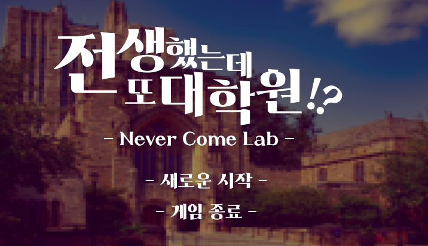
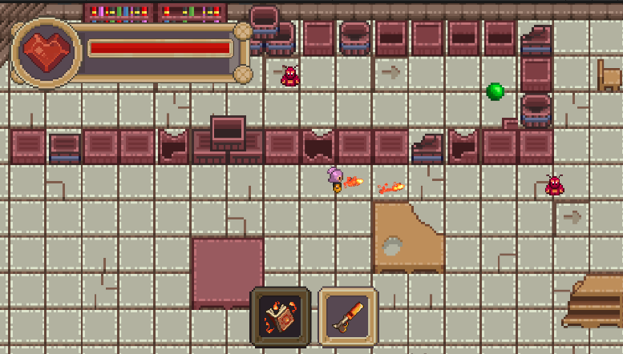

<div align="center">

# Never Come Lab
> **전생했는데 또 대학원?!🧑‍🎓**

</div>


## 프로젝트 정보 
- 유니티, 3개월 / 4명
- 맵퍼즐을 풀고, 몬스터를 피하거나 처치하여 스테이지들을 깨는 스토리 어드벤처 게임
- 만들래 10분 게임 콘테스트 출품작 
- [시연 영상](https://www.youtube.com/watch?v=q59HrhljNyg)
<table>
  <tr>
    <td></td>
    <td></td>
  </tr>
</table>

## 시놉시스

대학원 생활에 진절머리가 난 주인공은 자신의 처지를 한탄하며 걸어가다 그만 차에 치이고 만다.
그대로 죽는 줄만 알았던 순간, 눈을 떠보니 학부 1학년생이라고?!
그날의 중간고사로 돌아와버린 주인공 앞에는 괴물이 되어 득달같이 달려드는 문제더미가 도사리고 있었는데...
과연 우리의 주인공은 갖은 고초를 딛고 자신의 미래를 바꿀 수 있을 것인가!

## 조작법

- 캐릭터 이동:  WASD
- 상호작용&대화 넘기기: Enter
- 문 열기: F
- 무기변환: 1, 2 (혹은 UI 클릭)
※ 공격은 마우스 커서의 방향을 따라 무기 선택 시 자동 발사됩니다.

## 시스템

**게임 플레이**
- 퍼즐: 스테이지를 통과하기 위해 다양한 퍼즐을 해결해야 합니다.
- 전투: 무기를 사용해 다양한 몬스터와 전투할 수 있습니다.

**주요 게임 시스템**
- 플레이어 조작 : 상하좌우 대각선의 8방향으로 캐릭터를 움직일 수 있습니다.
- 무기 시스템 : 기본공격으로 화염 마법과 수면총을 사용할 수 있습니다. (수면 쿨타임 10초)
- 체력 : 체력을 관리하며 생존해야 합니다.

※ 해당 프로젝트는 FHD 환경에 최적화 되어있습니다.


## 담당
### Client 
- 전반적인 플레이어 로직(이동, 피격, 무기) 
- 플랫폼(레버, 숨기 기능)
- 사운드
- 씬 재시작 기능 

## 프로젝트 구조

```
Assets
 ┣ 📂 Animations             # 캐릭터 및 오브젝트 애니메이션
 ┣ 📂 Audio                  # BGM 및 효과음 리소스
 ┣ 📂 Data                   # 게임 데이터 (ScriptableObjects)
 ┣ 📂 Images                 # 배경 및 UI 이미지
 ┣ 📂 Prefabs                # 게임 오브젝트 프리팹 모음
 ┣ 📂 Scenes                 # 스테이지 및 시스템 씬
 ┣ 📂 Scripts                # C# 스크립트 소스 코드
 ┃ ┣ 📂 Core                 # 매니저모음 (Game, Audio, Pool)
 ┃ ┣ 📂 Entities             # 동적 오브젝트(플레이어, 몬스터, NPC)
 ┃ ┃ ┣ 📂 Monster            # 몬스터 관련 스크립트
 ┃ ┃ ┣ 📂 NPC                # NPC 관련 스크립트
 ┃ ┃ ┗ 📂 Player             # 플레이어 관련 스크립트
 ┃ ┣ 📂 Environment          # 오브젝트간 상호작용(함정, 레버, 문)
 ┃ ┣ 📂 Items                # 아이템 로직
 ┃ ┣ 📂 Stage                # 스테이지별 로직
 ┃ ┣ 📂 Systems              # 오디오, 대화, 퍼즐
 ┃ ┗ 📂 UI                   # 사용자 인터페이스
 ┣ 📂 Timeline               # 시네마틱 타임라인

```


## 패턴흐름도
### 레버


## 일화

### 싱글톤 패턴 남용

씬 전환시 싱글톤 게임매니저 내 오브젝트가 사라지는 문제가 발생함. 싱글톤 남용이 결합도를 높여 문제가 됨을 깨닫고 필요할 때만 사용해야함을 알게됌. 최고 레벨 상태나 전역 접근이 필요한 경우에만 싱글톤 적용하고, 그 외에는 직접 참조하도록 수정함.

### 레버의 확장성이 필요해짐

기존 레버는 하나의 벽만 제어해 기능 확장이 어려웠어서 여러 벽을 동시에 제어하고 다양한 동작을 지원하기 위해 메시지 기반 상호작용으로 리팩토링함. 동작 종류를 enum으로 분리하고 제어 대상을 리스트로 확장해 가독성과 재사용성을 높임.